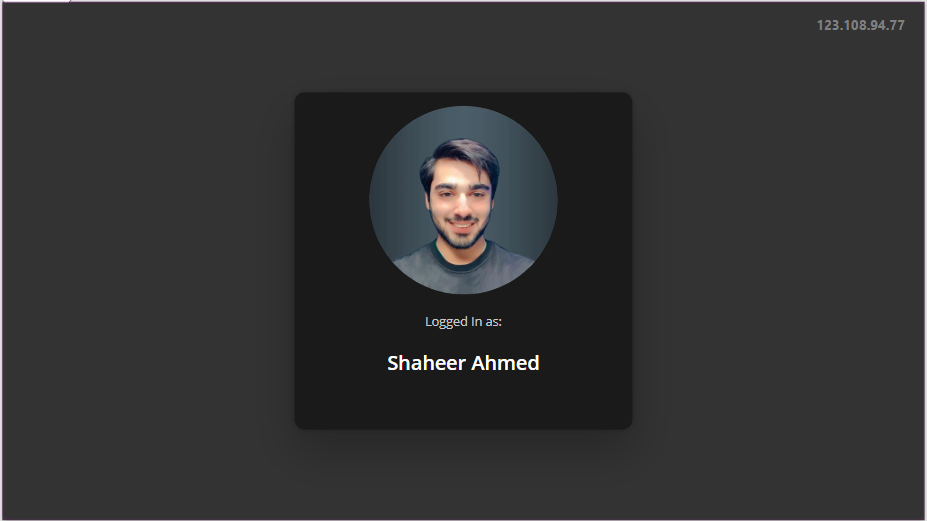
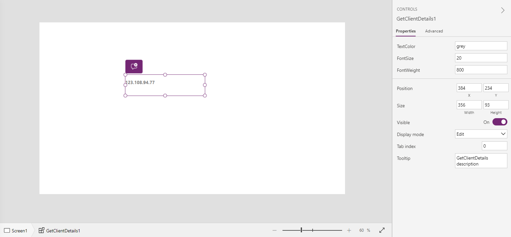

# Get Client Details PCF

The Get Client Details PCF component is designed to enforce IP address restrictions within your Canvas apps. This component allows on-site employees to restrict access based on IP addresses, enabling secure authentication using their work IP.

## Author

[Shaheer Ahmad](https://www.linkedin.com/in/shaheer-ahmad-ch/)

## Contact Information

[LinkedIn](https://www.linkedin.com/in/shaheer-ahmad-ch/)

[Email](mailto:shaheer.ashraf@live.com)

## Key Features

1. **IP Address Restriction:** Empower on-site employees to restrict access based on IP addresses, enhancing security measures within your Canvas apps.

2. **User-Friendly Interface:** Ability to customize Font Weight, Font Color and Font Size.

## Use Cases

- **Office Security:** Secure access to sensitive information by restricting login access to authorized IP addresses within office premises.

- **Remote Work Management:** Facilitate remote work arrangements by enabling IP address restrictions for employees accessing Canvas apps outside the office network.
 
## Get Started 

Download the managed solution from [here](./Solutions/GetClientDetails.zip)

Import the managed solution in your environment

Enable publishing of Code Componenet in your environment settings

Import the code componenet inside your canvas app

Configure the input properties

## License

This project is licensed under the [MIT License](LICENSE.md) - see the [LICENSE.md](LICENSE.md) file for details.